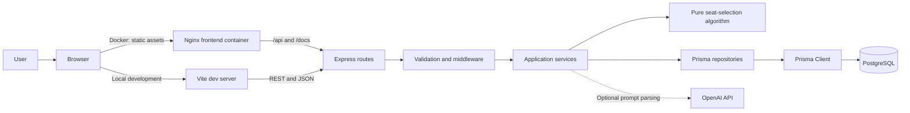
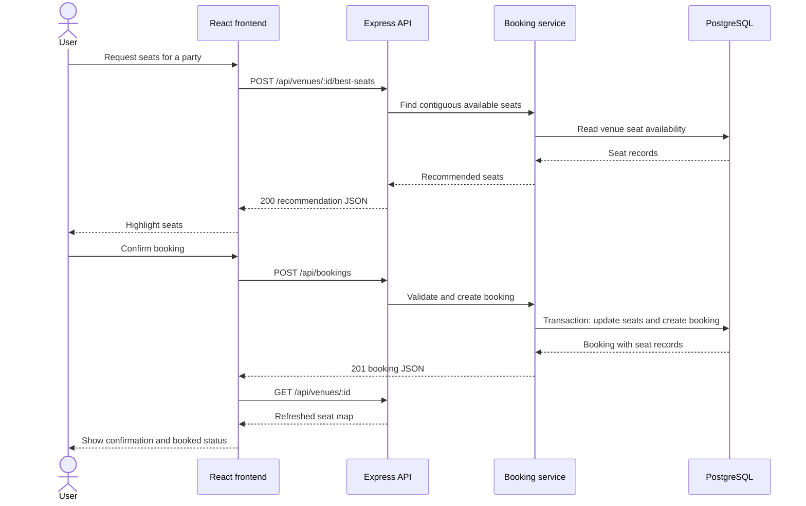
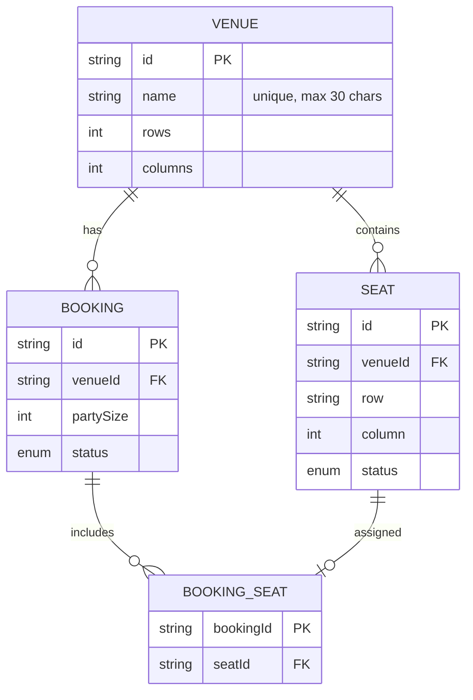

# Seat Selection System Architecture

This document describes the current application architecture, request flows, persistence model, technical dependencies, and scaling considerations. For reviewer startup and test commands, see [Setup-Instructions.md](Setup-Instructions.md). For implementation detail, see the [backend guide](backend/README.md) and [frontend guide](frontend/README.md).

Interactive diagrams: [Runtime architecture](docs/diagrams/runtime-architecture.html) and
[recommendation and booking flow](docs/diagrams/seat-recommendation-and-booking.html). Their editable
diagram definitions are stored beside them as JSON files.

## System Overview

The system consists of a React single-page application, an Express API, and PostgreSQL. The backend is a layered modular monolith; the frontend is a separate client application. In Docker Compose, Nginx serves the compiled frontend and proxies API and documentation requests to the backend. During local development, Vite serves the UI and the browser calls the API directly.

Before listening for requests, the API checks for an existing venue. If none exists, it transactionally creates a 10-row by 20-column **Default Venue**. A PostgreSQL advisory transaction lock prevents concurrent API instances from creating duplicate defaults.

The optional AI assistant extracts structured preferences from natural language. The deterministic seat selector remains the source of truth for recommendations; AI is not needed for browsing, standard recommendations, or booking.

## Request Flows

### Recommend and Book

1. The frontend loads venues and the selected venue's seat map.
2. The user chooses a party size and requests recommendations.
3. The API selects an available contiguous group. A viable closer row wins; within a row, the group nearest the center wins, with ties resolved toward lower seat numbers.
4. The frontend highlights the suggested seats. Recommendation is read-only and does not reserve them.
5. The user confirms the booking. `POST /api/bookings` validates the venue and seat IDs, checks seat availability inside a database transaction, changes seat status, and writes the booking plus booking-seat relationships.
6. The API responds with the created booking. The frontend displays human-readable seat labels and fetches the venue again to refresh the map.

Booking availability is claimed with a conditional update that changes only rows still marked `AVAILABLE`. The service checks the affected-row count before creating the booking; if another request claimed a seat first, it throws a conflict and the transaction rolls back. An integration test submits two concurrent requests for the same seat and verifies one `201` and one `409`.

### Manage Venues

Venue creation stores the layout and generates its seats transactionally. Names are required,
limited to 30 characters, and unique case-insensitively; duplicate names return `409 Conflict`.
Layouts allow up to 50 rows and 1,000 columns. Venue deletion removes related seats and bookings
through database cascade relations. In the UI, deletion uses its own venue dropdown rather than the
main screen's current venue selection, followed by inline confirmation. When `ADMIN_TOKEN` is
configured, create and delete requests require it; local development leaves it unset by default.

The venue form resets when the manager opens and after a successful create. Create/delete success
notices appear beside their corresponding form section; the page-level notice can be dismissed and
automatically hides after 10 seconds. A successful booking opens a dismissible confirmation dialog.

### Optional AI Assistant

The assistant sends the user's prompt to the backend, validates the extracted preferences, and passes those preferences into the normal deterministic selection flow. Its API key is optional and should be provided through environment configuration, never committed to source control.

## API Surface

| Method | Path | Purpose |
|---|---|---|
| `GET` | `/api/health` | Check API and database connectivity |
| `GET` | `/api/venues` | List venues |
| `POST` | `/api/venues` | Create a venue and its seats |
| `GET` | `/api/venues/:id` | Read a venue and its seat map |
| `DELETE` | `/api/venues/:id` | Delete a venue and related records |
| `POST` | `/api/venues/:id/best-seats` | Recommend seats for a party size |
| `POST` | `/api/venues/:id/seat-assistant` | Interpret an optional natural-language request |
| `POST` | `/api/bookings` | Book selected seats |
| `GET` | `/api/bookings/:id` | Retrieve a booking and its seats |

Swagger UI is served at `/docs` by the API. In Docker it is also proxied through the frontend container.

## Data Model

PostgreSQL stores venues, seats, bookings, and each booking's seat associations. Seat coordinates are unique within a venue. The `(venueId, status)` index supports availability queries.

## Project Boundaries

| Area | Location | Responsibility |
|---|---|---|
| Backend app setup | `backend/src/app.ts` | Configure middleware and register routes without starting a listener |
| Backend runtime | `backend/src/server.ts` | Start the HTTP listener |
| Environment configuration | `backend/src/config/environment.ts` | Load, validate, and default environment settings once at startup |
| Routes and schemas | `backend/src/routes/`, `backend/src/schemas/` | HTTP contract, request parsing, validation, and response codes |
| Middleware | `backend/src/middleware/` | Shared validation, authorization, rate limiting, and error handling |
| Services | `backend/src/services/` | Use cases and business workflows, including venue listing |
| Algorithm | `backend/src/algorithm/` | Pure deterministic selection rules, without HTTP or database dependencies |
| Repositories and database | `backend/src/repositories/`, `backend/src/db/`, `backend/prisma/` | Prisma persistence, schema, migrations, and seeds |
| Frontend workflow | `frontend/src/App.tsx` | Page-level state and API orchestration |
| Frontend components | `frontend/src/Components/` | Seat map, venue, recommendation, and booking UI |
| Tests | `backend/tests/`, `frontend/src/test/` | Backend unit/integration tests and frontend workflow tests |
| Runtime containers | `docker-compose.yml`, `backend/Dockerfile`, `frontend/Dockerfile` | Local database/API/frontend orchestration and image builds |

Keep HTTP details out of repositories, persistence out of the algorithm, and API calls out of presentational components. As the frontend grows, extract complex workflows from `App.tsx` into feature-owned modules such as `features/booking` and `features/venues`; keep shared UI and types in shared modules. On the backend, continue adding use cases behind the route/service/repository boundaries. Prefer the existing modular monolith until independent deployment or measured scaling needs justify a different service boundary.

## Technical Dependencies

| Area | Technologies |
|---|---|
| Frontend | React 19, React DOM 19, TypeScript 6, Vite 8, Tailwind CSS 4 |
| Frontend tests | Vitest 5, React Testing Library, jsdom |
| Backend | Node.js, TypeScript 5.9, Express 5 |
| API validation and docs | Zod 4, swagger-jsdoc, Swagger UI |
| Persistence | PostgreSQL 16, Prisma 6 |
| Backend tests | Vitest 4, Supertest |
| Operations | Docker Compose, Nginx, Pino structured logging, Express rate limiting |
| Optional AI | OpenAI SDK and `OPENAI_API_KEY` |

The frontend also lists TanStack Query and Zustand as dependencies, but the current application does not use them for application state or data fetching.

## Scaling and Production Considerations

- **Algorithm:** seat selection is $O(rows \times columns)$ in the worst case. At larger venue sizes, benchmark with representative database and traffic patterns rather than assuming latency from complexity alone.
- **Database reads:** the current recommendation path reads venue seats. For large venues, query only the availability needed by the algorithm and use the existing status index effectively.
- **Seat-map responses:** the venue endpoint currently returns the full map. Consider row-based pagination or viewport fetching if the payload becomes large.
- **Booking concurrency:** the conditional update guards seat claims, and an integration test verifies that simultaneous booking requests result in one success and one conflict. Add holds or queueing only if measured traffic requires stronger coordination.
- **Horizontal scale:** the API is stateless and can run multiple instances behind a load balancer. A managed PostgreSQL instance, connection-pool sizing, backups, and migrations should be part of production operations. Add caches, queues, or distributed holds only in response to measured needs.
- **Frontend delivery:** the container builds static assets and serves them with Nginx. A production deployment should use TLS at the ingress/load balancer, health monitoring, and an explicit cache policy for fingerprinted assets.

See [Setup-Instructions.md](Setup-Instructions.md) for local and Docker startup, tests, and verification.
