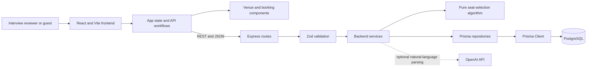
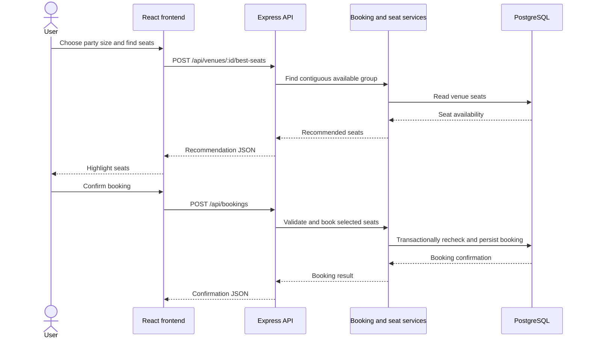
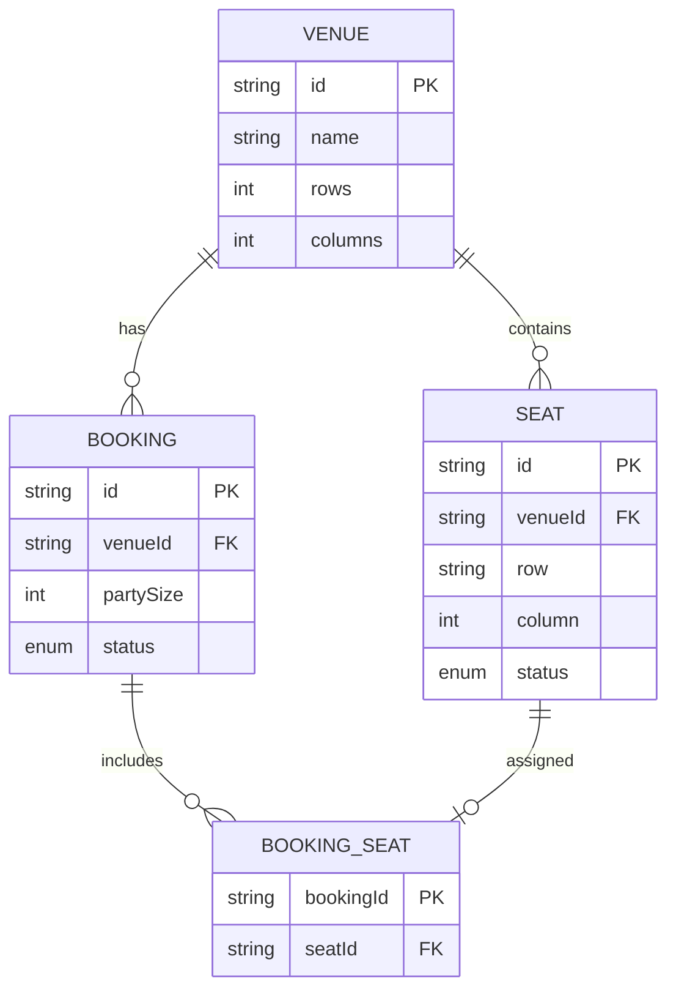

# Seat Selection System - Interview Brief

This document summarizes the completed full-stack seat-selection application for interview review. It covers the system design, main workflows, dependencies, and commands to run and test the application locally. Detailed implementation notes are available in the [backend guide](backend/README.md) and [frontend guide](frontend/README.md).

## Product Overview

The application lets users inspect venue seat availability, request the best contiguous seats for a party, and explicitly book those seats. It also supports venue management and an optional natural-language seat assistant.

## Architecture

The frontend is a React single-page application. It owns page-level state and user interaction, then calls the backend over REST/JSON. The backend is a layered Express application; the deterministic seat-selection algorithm is isolated from HTTP and database concerns.



The optional AI assistant extracts structured preferences from a prompt. The deterministic selector remains responsible for choosing seats; AI is not required for normal seat selection or booking.

## Main Workflows

### Recommend and Book Seats

1. The frontend loads venues and the selected venue's seat map.
2. The user chooses a party size and requests a recommendation.
3. The API selects a contiguous group of available seats. A viable closer row takes priority; within a row, the group nearest the center wins, with ties resolved toward lower seat numbers.
4. The frontend highlights the recommendation without changing seat availability.
5. The user explicitly confirms the booking. The backend rechecks availability inside a database transaction before creating the booking, preventing two concurrent requests from booking the same seat.
6. The frontend refreshes the venue data and shows the booking result.



### Manage Venues

Users can create a venue with a row and column layout or delete the selected venue. The backend creates the corresponding seats and persists the venue data. If `ADMIN_TOKEN` is configured, create and delete requests must include it; in local development it is unset by default.

### Optional AI Seat Assistant

The user can describe preferences in natural language. When `OPENAI_API_KEY` is configured, the backend parses the request into structured preferences and passes them into the seat-selection flow. Without the key, venue browsing, deterministic recommendations, and bookings remain available.

## API Surface

| Method | Path | Purpose |
|---|---|---|
| `GET` | `/api/health` | Check API and database connectivity |
| `GET` | `/api/venues` | List venues |
| `POST` | `/api/venues` | Create a venue and its seats |
| `GET` | `/api/venues/:id` | Read a venue and its seat map |
| `DELETE` | `/api/venues/:id` | Delete a venue and related records |
| `POST` | `/api/venues/:id/best-seats` | Recommend available seats for a party size |
| `POST` | `/api/venues/:id/seat-assistant` | Interpret an optional natural-language request |
| `POST` | `/api/bookings` | Book selected seats |
| `GET` | `/api/bookings/:id` | Retrieve a booking and its seats |

Interactive API documentation is served at `http://localhost:4000/docs` when the backend is running.

## Data Model

PostgreSQL stores venues, seats, bookings, and the booking-to-seat relationship. A venue owns its seats and bookings; a booking references its seats through a join table. Seat coordinates are unique within a venue, and the schema indexes venue and seat status for availability queries.



## Technical Dependencies

| Area | Technologies |
|---|---|
| Frontend | React 19, React DOM 19, TypeScript 6, Vite 8, Tailwind CSS 4 |
| Frontend tests | Vitest 5, React Testing Library, jsdom |
| Backend | Node.js 20, TypeScript 5.9, Express 5 |
| API validation and docs | Zod 4, Swagger UI, swagger-jsdoc |
| Persistence | PostgreSQL 16, Prisma 6 |
| Backend tests | Vitest 4, Supertest |
| Operations | Docker Compose, Pino structured logging, Express rate limiting |
| Optional AI | OpenAI SDK and an `OPENAI_API_KEY` |

Use Node.js 20.19+ or 22.12+ for local development. `npm ci` installs the versions pinned by each package lockfile. TanStack Query and Zustand are present in the frontend dependencies but are not currently used; shared frontend state is managed with React hooks and props.

## Run Locally

Prerequisites: Git, Node.js 20.19+ or 22.12+, and Docker Desktop with Docker Compose. Run the commands from PowerShell. Start a PostgreSQL container and two terminal windows from the repository root.

### Terminal 1: Database and backend

```powershell
# From the repository root

docker compose up -d postgres
Set-Location backend
if (-not (Test-Path .env)) { Copy-Item .env.example .env }
npm ci
npm run db:generate
npm run db:migrate
npm run db:seed
npm run dev
```

The API is available at `http://localhost:4000`. PostgreSQL is mapped to host port `5434`. The seed command creates sample venues.

### Terminal 2: Frontend

```powershell
# From the repository root

Set-Location frontend
if (-not (Test-Path .env)) { Copy-Item .env.example .env }
npm ci
npm run dev
```

Open `http://localhost:5173`. The frontend's default `VITE_API_URL` points to `http://localhost:4000`.

### Verify and stop

- Open `http://localhost:5173` and try seat recommendations and a booking.
- Run `Invoke-RestMethod http://localhost:4000/api/health` in PowerShell.
- Browse the API at `http://localhost:4000/docs`.
- Stop both development servers with `Ctrl+C`. From the backend terminal, run `Set-Location ..` and `docker compose down` to stop PostgreSQL while retaining its data. Add `-v` to `docker compose down -v` only when you also want to remove the database volume.

## Tests and Quality Checks

Run backend commands from `backend/`. PostgreSQL must be running for the backend integration tests:

```powershell
npm test
npm run lint
npm run typecheck
npm run build
```

Run frontend commands from `frontend/`:

```powershell
npm test
npm run lint
npm run typecheck
npm run build
```

Backend unit tests cover the seat-selection algorithm and edge cases. Backend integration tests exercise services and API behavior against PostgreSQL. Frontend tests use Vitest and React Testing Library. The repository CI workflow runs the project quality gates on pushes.

## Further Reading

- [Backend architecture, assumptions, scalability, and API details](backend/README.md)
- [Frontend components, state management, and frontend setup](frontend/README.md)
- [Fullstack challenge requirements](README-FS.md)
