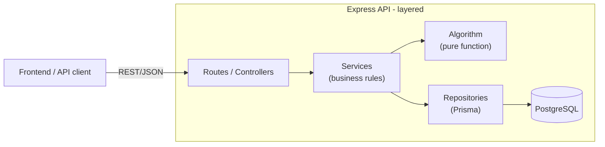
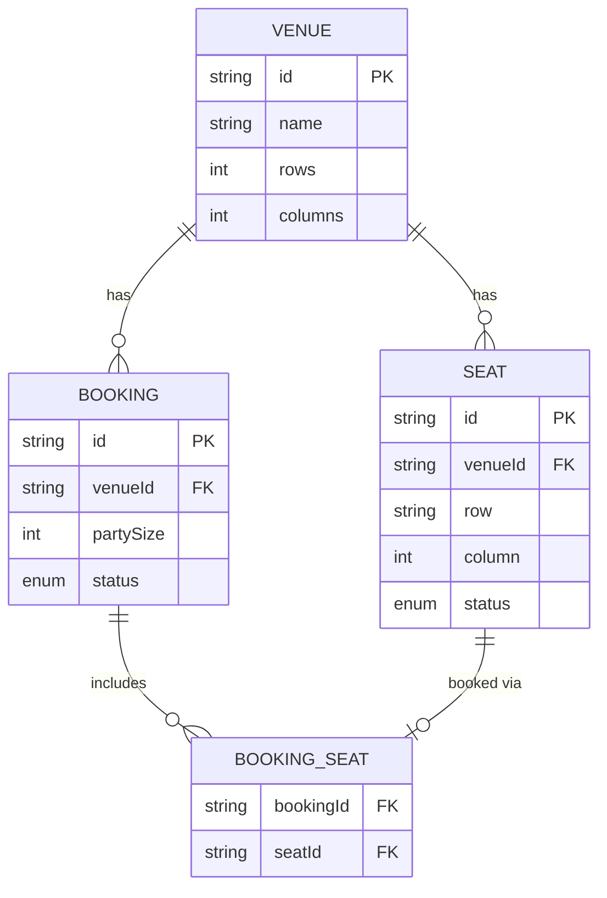

# Seat Selection API — Backend

REST API for a concert venue seat selection & booking system, built for the Skyward fullstack
coding challenge ([README-BE.md](../README-BE.md)). Implements base + mid-level + senior
requirements plus the requested bonuses (Docker, CI/CD, Swagger docs, rate limiting, full DB
implementation).

## Approach

The seat-selection algorithm is implemented as a **pure, framework-free function**
(`src/algorithm/seatSelector.ts`) with no dependency on Express or Prisma, so it can be unit
tested in complete isolation. It is wrapped by a layered architecture:

```
HTTP request
  → routes (Express routers)        — parses/validates input, shapes the HTTP response
  → services                        — business rules (booking transaction, orchestration)
  → algorithm                       — pure seat-selection logic (no I/O)
  → repositories (Prisma)            — data access
  → PostgreSQL
```

Each layer only depends on the one below it, so the algorithm, and each layer, can be tested
independently. See [Architecture](#architecture) below for the full rationale.

## Tech Stack

| Concern | Choice |
|---|---|
| Language / runtime | TypeScript, Node.js 20 |
| Framework | Express 5 |
| Validation | Zod |
| Database | PostgreSQL (via Docker) |
| ORM | Prisma |
| Testing | Vitest (unit + integration), Supertest |
| API docs | swagger-jsdoc + swagger-ui-express |
| Logging | pino / pino-http |
| Rate limiting | express-rate-limit |
| Build | `tsc` (no bundler needed for a Node backend) |

## Getting Started

### Prerequisites
- Node.js 20.19+ or 22.12+ (meets both backend and Vite requirements)
- Docker Desktop on Windows/macOS, or Docker Engine with the Compose plugin on Linux

### 1. Start PostgreSQL

From the **repo root**:

```bash
docker compose up -d postgres
```

> Note: the compose file maps Postgres to host port **5434** (not the default 5432), since 5432
> and 5433 were already in use by other local services during development. Adjust
> `docker-compose.yml` and `backend/.env` together if you need a different port.

### 2. Configure environment

Run the commands from the repository root:

macOS/Linux:
```bash
cd backend
cp .env.example .env
```

Windows PowerShell:
```powershell
Set-Location backend
Copy-Item .env.example .env
```

Windows Command Prompt:
```bat
cd backend
copy .env.example .env
```

Edit `backend/.env` if your local PostgreSQL port differs. `OPENAI_API_KEY` is optional for the
core booking app; set it there if you want to enable the AI seat assistant. Keep `.env` private and
do not commit it.

### 3. Install dependencies and generate Prisma Client

Run these commands from `backend/` in any shell:
```bash
npm ci
npm run db:generate
```

`npm ci` installs both the Prisma CLI (`prisma`) and generated-client runtime (`@prisma/client`)
from the lockfile. `db:generate` creates the local Prisma Client from `prisma/schema.prisma`; no
global Prisma installation is needed.

### 4. Apply migrations and seed sample venues

```bash
npm run db:migrate      # applies prisma/migrations to the local database
npm run db:seed         # seeds sample venues (10x12 and 10x50)
```

### 5. Run the API

```bash
npm run dev             # http://localhost:4000, auto-restarts on change
```

- Health check: `GET http://localhost:4000/api/health`
- Interactive API docs: `http://localhost:4000/docs`

### Run PostgreSQL and the API in Docker

```bash
docker compose up -d --build
```

Compose starts PostgreSQL and the API, waits for the database healthcheck, generates Prisma Client
during the backend image build, applies migrations in the container entrypoint, and exposes the API
at `http://localhost:4000`. It does not run the Vite frontend or seed sample venues. Start the
frontend separately using [frontend/README.md](../frontend/README.md); for a fresh database, create
a venue from **Manage Venues** or run the local seed command above. To enable AI in Docker, set
`OPENAI_API_KEY` in the repo-root `.env` before `docker compose up`; that file is ignored by Git.

## Running Tests

```bash
npm test          # unit + integration tests (requires Postgres running, see above)
npm run test:watch
npm run lint
npm run typecheck
```

- **Unit tests** (`tests/unit/`) — the seat-selection algorithm in isolation; encode the exact
  worked examples from README-BE.md plus edge cases (no available seats, party size larger than
  any run, gaps splitting a row, fallback to a farther row).
- **Integration tests** (`tests/integration/`) — services and HTTP endpoints against a real
  Postgres database, using dedicated ad-hoc venues per test file (cleaned up in `afterAll`) so
  they don't collide with seeded data. Includes a concurrency test proving the booking
  transaction rejects a seat that's already been booked.

## API Overview

| Method | Path | Description |
|---|---|---|
| GET | `/api/health` | Service + DB connectivity check |
| POST | `/api/venues` | Create a venue and generate its seats |
| GET | `/api/venues/:id` | Venue layout + full seat map |
| DELETE | `/api/venues/:id` | Delete a venue and cascade its seats/bookings |
| POST | `/api/venues/:id/best-seats` | Read-only: best contiguous seats for a party size |
| POST | `/api/venues/:id/seat-assistant` | Parse a natural-language seat request with AI, then use the deterministic selector |
| POST | `/api/bookings` | Book a specific set of seats |
| GET | `/api/bookings/:id` | Retrieve a booking and its seats |

Full request/response schemas: `/docs` (Swagger UI) once the server is running.

Venue creation and deletion accept the optional `ADMIN_TOKEN` environment variable. When it is
configured, send the token using `x-admin-token` or `Authorization: Bearer <token>`. The routes
remain open in local development when `ADMIN_TOKEN` is unset.

The seat assistant requires `OPENAI_API_KEY` and uses `OPENAI_MODEL` (default `gpt-4o-mini`). The
model only extracts structured preferences; the existing seat-selection algorithm remains the
source of truth and booking still requires a separate explicit request.

## Architecture



**Why a layered modular monolith instead of microservices:** the problem domain (one booking
flow) doesn't warrant the operational overhead of separate services. A layered structure gives
the same testability and separation-of-concerns benefits with far less complexity.

**Why the algorithm is a pure function:** it has zero dependencies on Express or the database, so
its 3 documented worked examples (and edge cases) can be verified with millisecond-fast unit
tests with no test database required.

**Why booking runs inside a Prisma `$transaction`:** the booking service re-reads seat status
*inside* the transaction before marking seats `BOOKED`. This closes the race window between
"check seat is available" and "mark seat booked" — two concurrent booking requests for the same
seat will have one succeed and one receive a `409 Conflict`, verified by an integration test.

### Frontend Components and State

The React frontend is documented in [frontend/README.md](../frontend/README.md). `frontend/src/App.tsx`
owns shared page state and API workflows; reusable page sections live in `frontend/src/Components/`:
`Header`, `ManageVenue`, `VenueControls`, `FindBestSeats`, `AskAI`, `VenueFloorSeating`, and
`BookSeats`. Shared state is passed through props using React's built-in hooks rather than a global
state store. `ManageVenue` keeps its temporary form inputs locally.

## Database Schema



`Seat` has a unique constraint on `(venueId, row, column)` and an index on `(venueId, status)` to
keep the common "list available seats for a venue" query fast as venue size grows.

## Handling Ambiguity — Assumptions

The challenge explicitly asks for documented assumptions where the spec is ambiguous:

1. **No solution behavior**: if no row has a contiguous block large enough for the requested
   party size, `/best-seats` returns `404 NO_SEATS_AVAILABLE` rather than an empty array — this
   was chosen to make "no valid seats" unambiguous to API consumers (vs. an empty 200 response,
   which could be mistaken for "zero seats requested").
2. **Best-seats is read-only**: `/best-seats` never mutates seat status. Only `POST /bookings`
   commits a reservation. This matches the documented user flow ("seats highlight as best
   available" → separate "Book These Seats" action).
3. **Row-dominance edge case**: if the closest row *cannot* fit the party contiguously (e.g. its
   free seats are fragmented by existing bookings), the algorithm falls through to the next row,
   rather than failing outright — "closer row always preferred" is interpreted as applying only
   among rows that can actually fit the group.
4. **Multi-letter rows**: the spec's examples only show single-letter rows (`a`–`j`), but the
   algorithm supports spreadsheet-style multi-letter rows (`aa`, `ab`, ...) for venues with 26+
   rows, since no upper bound was specified.
5. **Seat status values**: `AVAILABLE`, `RESERVED`, `BOOKED` are treated as the full status enum;
   only `AVAILABLE` seats are eligible for `/best-seats` or booking.

## Performance & Scalability

**Current algorithm**: O(rows × columns) worst case — for every row, seats are read once and
scanned once for contiguous runs. At 50,000 seats (e.g. 500 rows × 100 columns), this is still a
single-digit-millisecond operation in memory; the real cost at that scale is I/O, not the
algorithm itself.

**What would change for 50,000+ seats in production:**

- **Avoid loading the full seat map per request.** Today, `getBestSeats` loads every seat for a
  venue on every call. At large scale, this should be replaced with a query that only pulls
  `AVAILABLE` seats per row (`WHERE venueId = ? AND status = 'AVAILABLE'`, using the existing
  `(venueId, status)` index), and can stop early once a valid contiguous block is found in the
  frontmost row — avoiding a full table scan for every request.
- **Cache venue layout.** `rows`/`columns` almost never change; only seat status does. Layout
  could be cached (in-memory or Redis) separately from live seat status.
- **Avoid sending the entire seat map to the frontend.** `GET /venues/:id` should support
  pagination or viewport-based fetching (e.g. only rows currently visible) instead of returning
  all seats at once.
- **Concurrency at scale**: the current `$transaction` re-read approach works correctly but holds
  a row lock briefly per booking. At very high concurrent booking volume for the *same* popular
  seats, a queue-based approach (e.g. a short-lived Redis lock or seat "hold" with expiry) would
  reduce database contention compared to relying purely on transactional retries.
- **Horizontal scaling**: the API itself is stateless and can run multiple instances behind a
  load balancer; Postgres would need read replicas for the read-heavy `/venues/:id` and
  `/best-seats` paths if traffic grew significantly.

## Deployment Plan

- **Backend**: containerized via the provided `Dockerfile`; deployable as-is to Fly.io, Render,
  or Railway free tiers (all support arbitrary Docker images and injected env vars for
  `DATABASE_URL`, `CORS_ORIGIN`, `OPENAI_API_KEY`).
- **Database**: a managed free-tier Postgres (Neon, Supabase, or the target platform's own
  managed Postgres add-on) in production, instead of the local Docker container used for
  development.
- **CI/CD**: the existing GitHub Actions workflow (`.github/workflows/ci.yml`) already runs
  lint/typecheck/tests/build on every push; a deployment job could be added that builds and
  pushes the Docker image, then triggers a deploy hook on the chosen platform.
- **Migrations in production**: the Docker entrypoint runs `prisma migrate deploy` automatically
  on container start, so schema changes ship atomically with each deploy.

## Requirements Checklist (README-BE.md)

| Requirement | Status |
|---|---|
| Core seat selection algorithm | ✅ `src/algorithm/seatSelector.ts` |
| REST endpoint(s) for best seats + venue status | ✅ |
| Automated tests (algorithm) | ✅ unit tests for examples and edge cases |
| README: approach, run, test instructions | ✅ (this file) |
| Error handling & validation (Mid) | ✅ Zod + typed `AppError` hierarchy |
| Additional endpoint — booking (Mid) | ✅ `POST /api/bookings` |
| Integration/API tests (Mid) | ✅ service and API integration tests |
| API documentation (Mid) | ✅ Swagger UI at `/docs` |
| DB schema with relationships (Senior) | ✅ Prisma schema, see [above](#database-schema) |
| Architectural documentation (Senior) | ✅ see [Architecture](#architecture) |
| Performance/scalability discussion (Senior) | ✅ see [above](#performance--scalability) |
| Observability (bonus) | ✅ pino structured logging |
| Concurrent booking handling (bonus) | ✅ transactional re-check, tested |
| Dockerization (bonus) | ✅ multi-stage `Dockerfile` + compose |
| CI/CD pipeline (bonus) | ✅ GitHub Actions |
| API documentation UI (bonus) | ✅ Swagger UI |
| Rate limiting (bonus) | ✅ `express-rate-limit` |
| Database implementation (bonus) | ✅ fully implemented, not just schema |
| Deployment (bonus) | ✅ documented plan (not deployed live) |
| AI integration (bonus) | ✅ natural-language seat assistant with validated output and mocked tests |
